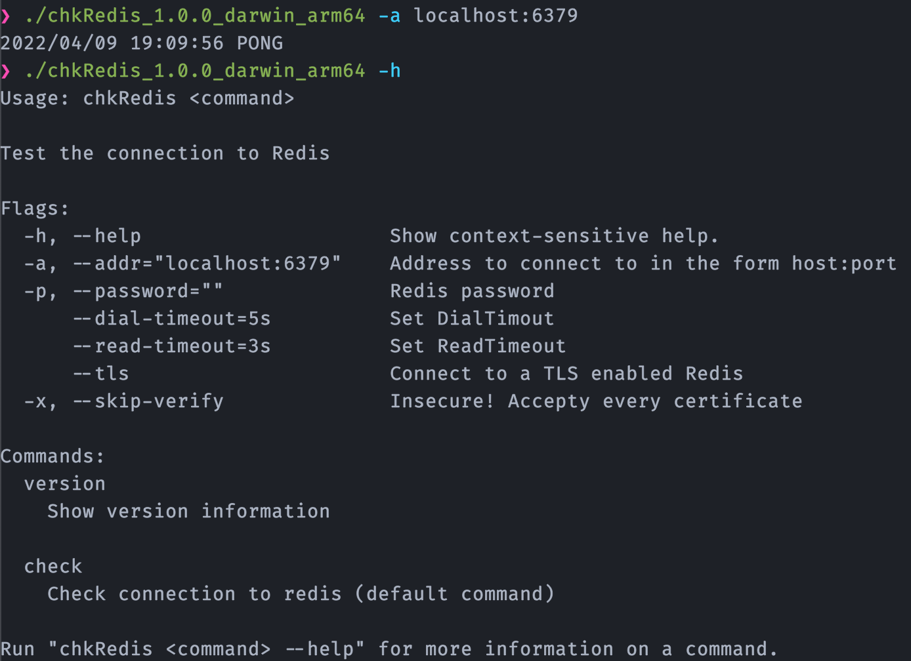

# chkRedis

A small Go program to verify the connection to a [Redis](https://redis.io/) and [Valkey](https://valkey.io/) in-memory data store.

- Run `./chkRedis -h` for available options and defaults
- Tested against Redis 7.2 and valkey 7.2
- Executes a `PING` command to verify the connection
- Not compatible with RBAC

See my [blog post](https://rootknecht.net/blog/redis-con/) why I wrote chkRedis.

Check the [Taskfile](./Taskfile.yml) ([Task](https://taskfile.dev/) is required) for useful commands.
